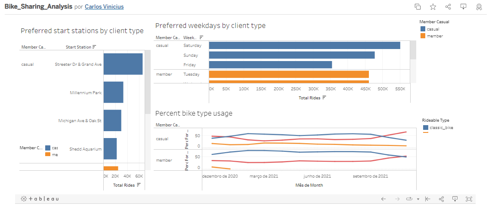

# Projeto de Análise de Dados para uma empresa fictícia de aluguel de bicicletas (Português)

Este é um Projeto de análise de dados com o objetivo de analisar dados de uma empresa fictícia de aluguel de bicicletas, e recomendar decisões de negócio.

O cenário é de uma empresa fictícia chamada Cyclistic, que realiza aluguel de bicicletas em Chicago, US, e possui mais de 5800 bicicletas e 600 postos físicos.
Este cenário foi proposto no [Google Data Analytics Professional Certificate](https://www.coursera.org/professional-certificates/google-data-analytics?). A análise feita é totalmente pessoal.

O dataset utilizado é composto por dados públicos da empresa Motivate International Inc., que estão sob esta [licença](https://ride.divvybikes.com/data-license-agreement), e servirão
como os dados fictícios da nossa empresa fictícia Cyclistic. [Link para baixar o dataset](https://divvy-tripdata.s3.amazonaws.com/index.html).

O objetivo deste projeto de análise de dados é identificar insights que ajudem na definição de métricas, e planejamento de metas e estratégias de business para que mais clientes da empresa realizem a assinatura anual de fidelidade.

O dashboard principal da etapa de data visualization pode ser encontrado [aqui](https://public.tableau.com/app/profile/carlos.vinicius3512/viz/Bike_Sharing_Analysis_16407949341070/Dashboard6).

A análise sugere que os clientes casuais tendem a preferir alugar no sábado ou domingo e possuem um interesse cada vez maior em bicicletas elétricas. Além disso, a quantidade de aluguéis partindo da estação Streeter Dr & Grand Ave é cerca de duas vezes maior que as outras três estações mais populares.

Uma simples recomendação de negócio com base nesta análise seria enviar e-mails nas quintas-feiras ou sextas-feiras para os clientes casuais, contendo recomendação para os mesmos assinarem o plano anual, oferecendo ofertas atrativas para os seus interesses principais: fins de semanas, bicicletas elétricas, e a estação Streeter Dr & Grand Ave.

# Data Analysis Project for a fictitious bike sharing company (English)

This is a Data Analysis Project with the objective of analyzing data from a fictitious bicycle rental company, and recommending business decisions.

The scenario is of a fictional company called Cyclistic, which rents bicycles in Chicago, US, and has more than 5800 bicycles and 600 physical stations.
This scenario was proposed in the course [Google Data Analytics Capstone: Complete a Case Study](https://www.coursera.org/learn/google-data-analytics-capstone?). The analysis made is completely personal.

The dataset used is composed of public data from the company Motivate International Inc., which are under this [license] (https://ride.divvybikes.com/data-license-agreement), and will serve as the fictitious data of our fictitious company Cyclistic. [Link to download dataset](https://divvy-tripdata.s3.amazonaws.com/index.html).

The objective of this data analysis project is to identify insights that help define metrics, and plan business goals and strategies so that more customers of the company sign up for the annual membership subscription.

The main dashboard of the data visualization step can be found [here](https://public.tableau.com/app/profile/carlos.vinicius3512/viz/Bike_Sharing_Analysis_16407949341070/Dashboard6).

The analysis suggests that casual customers tend to prefer Saturday or Sunday rent and they have a growing interest in electric bikes. Also, the amount of rentals departing from the Streeter Dr & Grand Ave station is about twice as high as the other three most popular stations.

A simple business recommendation based on this analysis would be to send emails on Thursdays or Fridays to casual customers, containing a recommendation for them to subscribe to the annual plan, offering attractive offers for their main interests: weekends, electric bikes, and the Streeter Dr & Grand Ave station.
